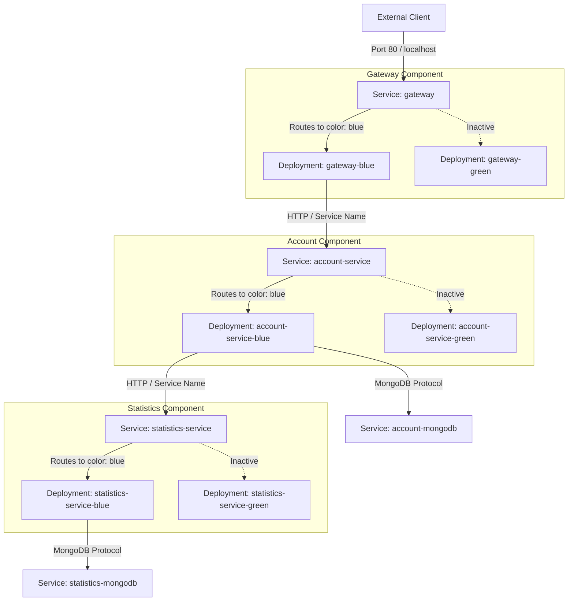
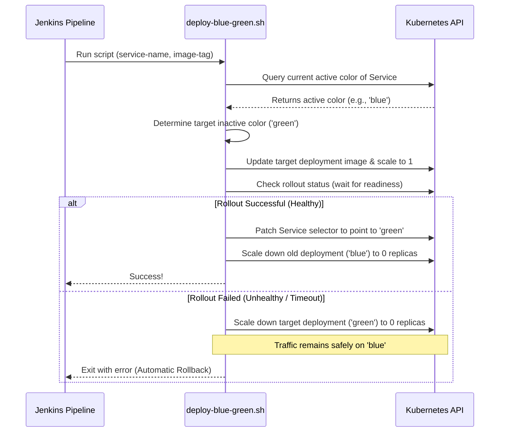

# PiggyMetrics Blue-Green Deployment Strategy

This document details the architecture, design, and rollback mechanism for the microservices-based PiggyMetrics application on Kubernetes.

## Architecture Diagram

The following Mermaid diagram visualizes the flow of an external client request hitting the API Gateway, and how the Gateway and services route traffic using Kubernetes Services (active color selectors) instead of default Eureka registry entries.



---

## Technical Details

### 1. Bypassing Spring Cloud Eureka
In a standard Spring Cloud environment, services register with Eureka and resolve each other's addresses using the Eureka registry. 
However, for a strict, Kubernetes-native Blue-Green switch (where we update a Kubernetes Service selector to flip 100% of traffic instantly), Eureka creates a conflict because it performs client-side load balancing based on individual pod IPs.

To resolve this, we configure:
- `EUREKA_CLIENT_ENABLED=false` to disable registry registration.
- `RIBBON_EUREKA_ENABLED=false` to stop Ribbon from querying Eureka.
- `<SERVICE-NAME>_RIBBON_LISTOFSERVERS=http://<service-name>:<port>` to configure Ribbon to use the Kubernetes cluster Service DNS name.

This ensures all service-to-service communication is routed via standard Kubernetes Services, which dynamically direct traffic to the active color.

### 2. The Blue-Green Pipeline Flow

The deployment lifecycle is automated via the [deploy-blue-green.sh](file:///Users/nikhildhakad/data/test/auriga/piggymetrics/scripts/deploy-blue-green.sh) script, executing the following logic:



---

## Deployment & Rollback Scenarios

### Scenario A: Successful Deploy
1. Service `account-service` is routing to `color: blue`. Pod `account-service-blue` is handling traffic. Pod `account-service-green` is scaled to `0` replicas.
2. A new build runs in Jenkins. It compiles code, builds image, and tags it as `v2`.
3. Jenkins runs `./scripts/deploy-blue-green.sh account-service v2`.
4. The script sets `account-service-green` image to `v2` and scales it to `1` replica.
5. The script waits for the green pod to pass Kubernetes liveness and readiness probes.
6. The green pod becomes ready. The script updates the `account-service` service's selector to `color: green`.
7. Traffic switches instantly to green.
8. The script scales down `account-service-blue` to `0` replicas.

### Scenario B: Automatic Rollback (Deployment Failure)
1. Service `account-service` is routing to `color: blue`.
2. A new build with a bug is triggered.
3. Jenkins runs the script to deploy to `green`.
4. Green is scaled up, but fails to start (e.g. CrashLoopBackOff, failed readiness check).
5. The `kubectl rollout status` times out.
6. The script detects failure. It **does not** modify the `account-service` service selector. Traffic remains 100% on the healthy `blue` version.
7. The script scales down the failed `green` deployment to `0` replicas.
8. Jenkins pipeline fails, and notifications are sent.

### Scenario C: Manual Rollback (Post-deployment Bug)
If a critical bug is discovered *after* a successful switch (e.g. green is active, but showing runtime errors):
1. Execute the manual rollback command to switch the Service selector back to the previous color:
   ```bash
   kubectl patch svc account-service -p '{"spec":{"selector":{"color":"blue"}}}'
   ```
2. Scale up the blue deployment to restore service:
   ```bash
   kubectl scale deployment/account-service-blue --replicas=1
   ```
